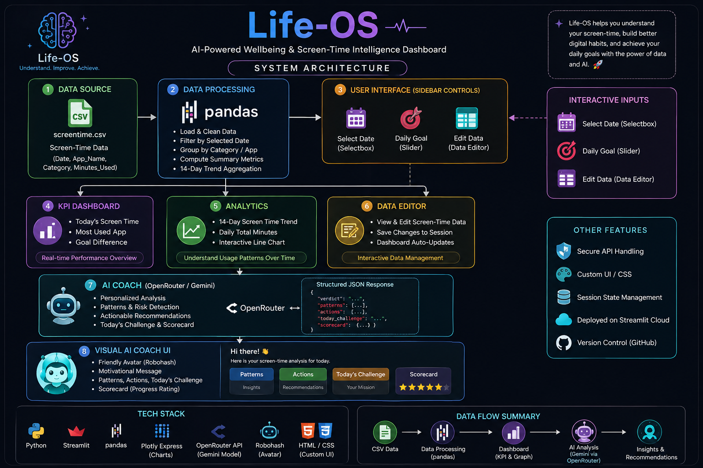
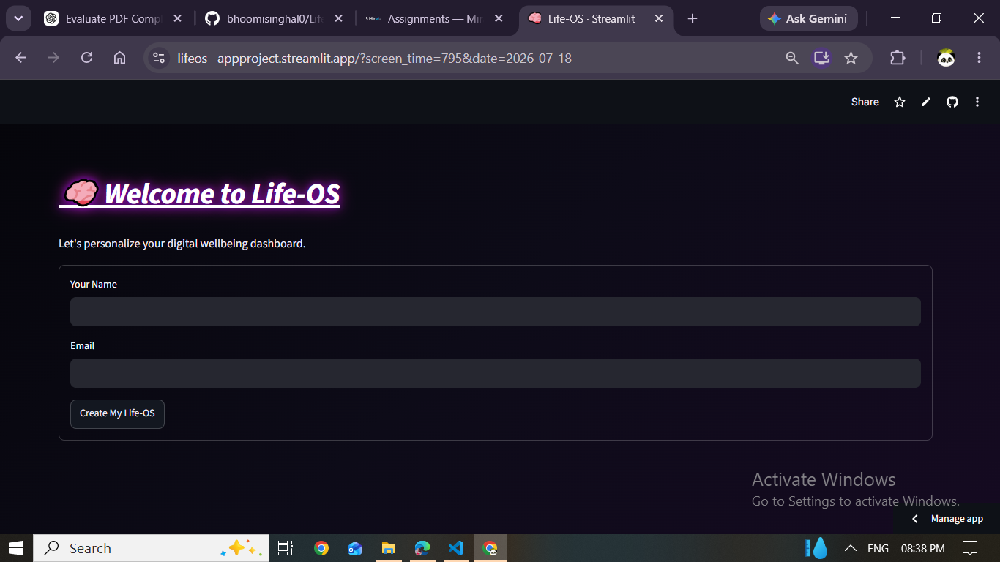

{align=“center”}

# 🧠 Life-OS

### *AI-Powered Digital Wellbeing Dashboard*

### 🚀 Reclaim your time, one mindful day at a time.

------------------------------------------------------------------------

# 📖 About the Project

**Life-OS** is an AI-powered digital wellbeing dashboard built with
**Python, Streamlit, Pandas, OpenRouter, and Gemini 2.5 Flash**. The
application helps users understand their daily screen-time habits
through:

- 📊 KPI-based screen-time analytics
- 📈 14-day usage trends
- 🤖 AI-powered digital wellbeing coaching
- 📸 Camera/upload-based screen-time screenshot analysis
- ✏️ User editing and verification of AI-extracted data
- 📅 Importing verified screenshot data as a new day
- 🎭 AI-generated digital lifestyle avatars
- 🔗 Shareable accountability links
- 💬 Personalized questions for the AI coach

The project was developed as part of the **MirAI School of Technology
–** **AI Builder Virtual Summer Internship 2026**.

------------------------------------------------------------------------

# 🏗️ System Architecture

Life-OS follows a modular pipeline that transforms raw screen-time data
into analytics and personalized AI insights.

## 🔄 Data Flow

                             ┌──────────────────────┐
                             │   Screen-Time Data   │
                             │  CSV / Camera / File │
                             └──────────┬───────────┘
                                        │
                        ┌───────────────┴───────────────┐
                        │                               │
                        ▼                               ▼
                 Existing CSV                  Screenshot Input
                        │                               │
                        │                         Gemini Vision
                        │                               │
                        │                         JSON Extraction
                        │                               │
                        │                         Validation
                        │                               │
                        │                         User Editing
                        │                               │
                        │                      Verify & Import
                        │                               │
                        └───────────────┬───────────────┘
                                        ▼
                             ┌──────────────────────┐
                             │ Pandas DataFrame     │
                             │ + Session State      │
                             └──────────┬───────────┘
                                        │
                     ┌──────────────────┼──────────────────┐
                     ▼                  ▼                  ▼
                 KPI Layer         Analytics Layer     Data Table
                     │                  │                  │
                     └──────────────────┼──────────────────┘
                                        ▼
                             ┌──────────────────────┐
                             │   AI Coach Layer     │
                             │ Gemini 2.5 Flash     │
                             │ Structured JSON      │
                             └──────────┬───────────┘
                                        ▼
                             ┌──────────────────────┐
                             │ Streamlit UI         │
                             │ Insights + Actions   │
                             └──────────────────────┘

## 🤖 API Integration Strategy

Life-OS uses **Gemini 2.5 Flash through OpenRouter**.

- The application uses the OpenAI-compatible Python client.
- OpenRouter is configured as the API base URL.
- The API key is loaded from an environment variable using
  `python-dotenv`.
- `google/gemini-2.5-flash` is used for AI wellbeing coaching and
  multimodal screenshot analysis.
- For screenshot analysis, the uploaded image is sent to Gemini together
  with a structured extraction prompt.
- Gemini returns structured JSON containing screen-time records.
- The extracted JSON is validated before it can be imported.
- The AI Coach receives the selected day’s processed screen-time summary
  and daily goal as dynamic prompt context.
- The AI Coach is instructed to return structured JSON containing the
  verdict, patterns, main issue, actions, challenge, and scorecard.
- The application parses the JSON in Python and renders the individual
  sections in the Streamlit interface.
- Avatar generation uses Gemini to create an image-generation prompt,
  which is then sent to Pollinations for image generation.

## 🧩 Logic Modules

| Module                       | Responsibility                                                                               |
|------------------------------|----------------------------------------------------------------------------------------------|
| **Onboarding Module**        | Collects the user’s name and initializes the Life-OS session                                 |
| **Data Loader**              | Loads `screentime.csv` into a Pandas DataFrame                                               |
| **Session State Manager**    | Maintains edited data, selected date, goal, AI results, avatar state, and imported-day state |
| **Dashboard Analytics**      | Calculates total screen time, most-used app, goal difference, category summaries, and trends |
| **Screenshot Analyzer**      | Accepts camera or uploaded screen-time screenshots and sends them to Gemini Vision           |
| **Extraction Validator**     | Checks Gemini’s JSON structure, app names, categories, and minute values                     |
| **Review & Import Module**   | Lets users edit, add, or remove extracted records and import a verified day                  |
| **AI Wellbeing Coach**       | Generates structured, personalized digital wellbeing recommendations                         |
| **Personal Question Module** | Allows users to ask additional questions using the current screen-time context               |
| **Avatar Companion**         | Generates a lifestyle-based avatar prompt with Gemini and an image through Pollinations      |
| **Visualization Layer**      | Displays KPI cards, trend charts, data tables, AI insights, and avatar content               |
| **Sharing Layer**            | Creates shareable accountability links using Streamlit query parameters                      |

------------------------------------------------------------------------

Module Responsibility

------------------------------------------------------------------------

**Onboarding Module** Collects the user’s name and initializes the
Life-OS session **Data Loader** Loads `screentime.csv` into a Pandas
DataFrame **Session State Manager** Maintains edited data, selected
date, goal, AI results, avatar state, and imported-day state **Dashboard
Analytics** Calculates total screen time, most-used app, goal
difference, category summaries, and trends **Screenshot Analyzer**
Accepts camera or uploaded screen-time screenshots and sends them to
Gemini Vision **Extraction Validator** Checks Gemini’s JSON structure,
app names, categories, and minute values **Review & Import Module** Lets
users edit, add, or remove extracted records and import a verified day
**AI Wellbeing Coach** Generates structured, personalized digital
wellbeing recommendations **Personal Question Module** Allows users to
ask additional questions using the current screen-time context **Avatar
Companion** Generates a lifestyle-based avatar prompt with Gemini and an
image through Pollinations **Visualization Layer** Displays KPI cards,
trend charts, data tables, AI insights, and avatar content

------------------------------------------------------------------------

# ✨ Features

## 📊 1. Smart Dashboard

The Overview dashboard provides:

- Daily screen-time total
- Most-used application
- Goal difference
- Category-based usage summary
- 14-day screen-time trend
- Interactive screen-time data table
- Custom daily screen-time goal
- Dynamic date selection

------------------------------------------------------------------------

## 📸 2. AI Screen-Time Screenshot Import

Users can provide their phone’s screen-time information without manually
entering every application.

### Input options

- 📷 Take a screenshot using the camera input
- 📁 Upload an existing PNG/JPG/JPEG screenshot

The screenshot is analyzed by **Gemini 2.5 Flash** and converted into
structured screen-time records.

### Extraction pipeline

    Screenshot
        ↓
    Gemini Vision
        ↓
    Structured JSON
        ↓
    Validation
        ↓
    Editable Table
        ↓
    User Verification
        ↓
    Import as New Day

The extracted information can include:

- App name
- Category
- Minutes used
- Date when available

------------------------------------------------------------------------

## ✏️ 3. Human Verification & Editing

AI-extracted data is **not imported blindly**. After extraction, the
user receives an editable table using Streamlit’s `st.data_editor`.
Users can:

- ✏️ Edit app names
- ✏️ Change categories
- ✏️ Correct usage minutes
- ➕ Add missing applications
- 🗑️ Remove incorrect rows
- 📅 Select or correct the date
- ✅ Verify the final data before importing

The application validates the edited records and prevents duplicate
dates from being imported.

------------------------------------------------------------------------

## 📥 4. New-Day Import

After verification, the corrected screenshot data is converted into
Life-OS’s standard structure:

    Date
    App_Name
    Category
    Minutes_Used

The new day is added to the current session’s Pandas DataFrame. The
imported date is then available to the dashboard so that:

- KPIs update
- Tables update
- Trends update
- AI Coach uses the new day’s data

------------------------------------------------------------------------

## 🤖 5. AI Wellbeing Coach

The AI Coach uses **Gemini 2.5 Flash through OpenRouter**. It analyzes
the selected day’s screen-time behavior and returns structured coaching
information including:

### 🎯 Verdict

A short assessment of the user’s digital wellbeing.

### 🔍 Patterns

Identifies meaningful usage patterns.

### 🚨 Main Issue

Highlights the most important area requiring attention.

### 💡 Action Plan

Provides practical recommendations with priorities.

### 🎯 Today’s Challenge

Provides one small, achievable action.

### 💪 Scorecard

Provides:

- Strength
- Attention
- Next Step

The AI is instructed to:

- Use only supplied screen-time data
- Never invent screen-time numbers
- Recognize productive coding and educational usage
- Avoid recommending reductions in productive coding
- Suggest offline alternatives for excessive social media or
  entertainment usage
- Keep recommendations practical and concise

------------------------------------------------------------------------

## 💬 6. Personalized AI Questions

Users can ask the AI Coach additional questions about their digital
wellbeing. The question is submitted through a Streamlit form and sent
together with the current screen-time context. This allows users to ask
for more specific guidance instead of relying only on the automatically
generated coaching response.

------------------------------------------------------------------------

## 🎭 7. AI Digital Avatar Companion

Life-OS creates a visual representation of the user’s digital lifestyle.
Depending on the user’s screen-time behavior, the application can
represent the user as:

- 🛡️ **Focus Warrior**
- 😴 **Distracted Student**
- 🧟 **Doomscroll Zombie**

Gemini generates the image-generation prompt and Pollinations generates
the final visual. The avatar is cached in `st.session_state` for the
selected day so unnecessary regeneration is avoided.

------------------------------------------------------------------------

## 📈 8. Analytics

The Analytics section provides:

- 14-day screen-time trend
- Interactive screen-time data editor
- Session-based data updates

Users can modify their screen-time data and save the changes for the
current application session.

------------------------------------------------------------------------

## 🔗 9. Shareable Accountability Link

Life-OS uses **Streamlit query parameters** to create a shareable
accountability link. A shared URL can contain:

    ?screen_time=795&date=2026-07-18

This allows users to share their selected screen-time result with an
accountability partner.

------------------------------------------------------------------------

## 🎨 10. Modern UI

The application uses a custom dark futuristic interface with:

- 🌌 Neon glassmorphism styling
- 💜 Purple accent theme
- 📊 KPI cards
- 🧭 Sidebar navigation
- ✨ Custom CSS
- 📱 Responsive Streamlit layout
- 🖼️ AI avatar presentation
- 🧩 Structured AI coaching sections

------------------------------------------------------------------------

# 🛠️ Tech Stack

Technology Purpose

------------------------------------------------------------------------

**Python 3.11** Core application logic **Streamlit** Web application and
UI **Pandas** Data processing and analytics **OpenRouter API** AI model
access layer **Gemini 2.5 Flash** AI coaching and screenshot analysis
**Pollinations AI** AI avatar image generation **OpenAI Python Client**
OpenRouter-compatible API communication **python-dotenv** Secure
environment-variable loading **HTML + CSS** Custom interface styling
**Streamlit Session State** Session-level application state **Streamlit
Query Parameters** Shareable accountability links

------------------------------------------------------------------------

# 🧠 Key Implementation Highlights

## Session State Management

`st.session_state` is used to maintain application state during the
active session, including:

- User name
- Selected date
- Daily screen-time goal
- Edited screen-time DataFrame
- AI coaching response
- Avatar URL and avatar date
- Imported screenshot date
- Extracted screenshot data
- Reviewed screen-time data

This allows imported and edited data to remain available across
Streamlit reruns.

------------------------------------------------------------------------

## Structured AI Responses

The AI Coach is instructed to return JSON with the following structure:

    verdict
    snapshot
    patterns
    main_issue
    actions
    today_challenge
    scorecard

The application:

1.  Receives the model response.
2.  Removes optional Markdown code fences.
3.  Parses the response using Python’s `json` module.
4.  Stores the structured result in `st.session_state`.
5.  Displays the individual sections in the UI.

------------------------------------------------------------------------

## Screenshot Data Validation

Before screenshot data is imported, the application checks:

- Whether the Gemini response is a JSON object
- Whether the `apps` field exists
- Whether `apps` is a list
- Whether app names are present
- Whether categories are valid
- Whether usage values can be converted to integers
- Whether usage values are non-negative

Invalid records are ignored instead of being directly inserted into the
main dataset.

------------------------------------------------------------------------

## Human-in-the-Loop AI Pipeline

Life-OS intentionally keeps the user in control of AI-extracted data:

    AI Extraction
         ↓
    Validation
         ↓
    Human Review
         ↓
    Human Editing
         ↓
    Verification
         ↓
    Import

This reduces the risk of incorrect OCR/vision extraction affecting the
dashboard.

------------------------------------------------------------------------

## Graceful Error Handling

AI and avatar operations are wrapped with error handling so that a
temporary API or generation failure does not bring down the complete
dashboard. The application provides user-facing warnings, errors, or
toast notifications where appropriate.

------------------------------------------------------------------------

# 📂 Project Structure

    Life-OS/
    │
    ├── app.py
    ├── style.css
    ├── screentime.csv
    ├── requirements.txt
    ├── .gitignore
    ├── README.md
    │
    ├── docs/
    │   └── System_architecture.png
    │
    ├── screenshots/
    │   ├── dashboard.png
    │   ├── coach.png
    │   ├── avatar.png
    │   ├── kpi.png
    │   └── graph.png
    │
    └── .env

> ⚠️ `.env` should contain your local API key and should **not** be
> committed to GitHub.

------------------------------------------------------------------------

# ⚙️ Installation & Setup

## 1. Clone the repository

    git clone https://github.com/bhoomisinghal0/LifeOs--StreamlitProject

## 2. Enter the project directory

    cd LifeOs--StreamlitProject

## 3. Install dependencies

    pip install -r requirements.txt

## 4. Create a `.env` file

    OPENROUTER_API_KEY=YOUR_OPENROUTER_API_KEY

## 5. Run the application

    streamlit run app.py

------------------------------------------------------------------------

# 🌐 Live Demo

🔗 **Live Application**
[https://lifeos–appproject.streamlit.app/?screen_time=795&date=2026-07-18](https://lifeos--appproject.streamlit.app/?screen_time=795&date=2026-07-18)

------------------------------------------------------------------------

# 💻 GitHub Repository

🔗
[https://github.com/bhoomisinghal0/LifeOs–StreamlitProject](https://github.com/bhoomisinghal0/LifeOs--StreamlitProject)

------------------------------------------------------------------------

# 📸 Screenshots

## ✅ Sign Up

------------------------------------------------------------------------

## 🏠 Dashboard

------------------------------------------------------------------------

## 🤖 AI Coach

------------------------------------------------------------------------

## 🎭 Digital Avatar

------------------------------------------------------------------------

## 📊 KPI Dashboard

------------------------------------------------------------------------

## 📈 Analytics

------------------------------------------------------------------------

# 🔮 Future Improvements

- 🎤 Voice Journal
- 📱 Direct smartphone Screen-Time API integration
- 📅 Weekly habit reports
- 📈 Productivity score
- 🏆 Achievement badges

------------------------------------------------------------------------

# 👨‍💻 Developer

**Bhoomi Singhal** B.Tech CSE Student **MirAI School of Technology – AI
Builder Internship 2026** LinkedIn:
<https://www.linkedin.com/in/bhoomi-singhal-a558a736b/> GitHub:
<https://github.com/bhoomisinghal0>

------------------------------------------------------------------------

{align=“center”}

### ⭐ If you like this project, consider giving it a star!

Made with ❤️ using Streamlit, Pandas & AI
