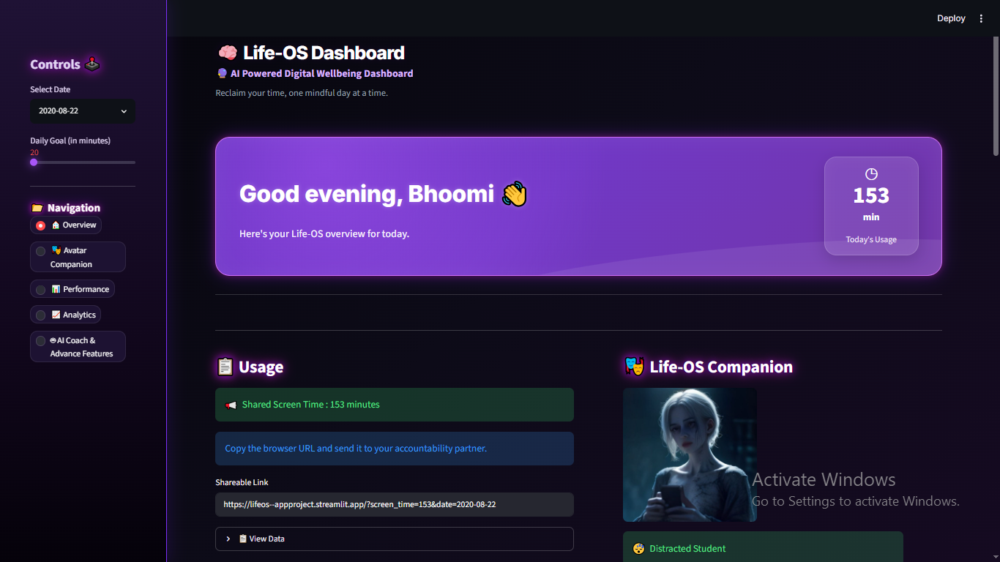
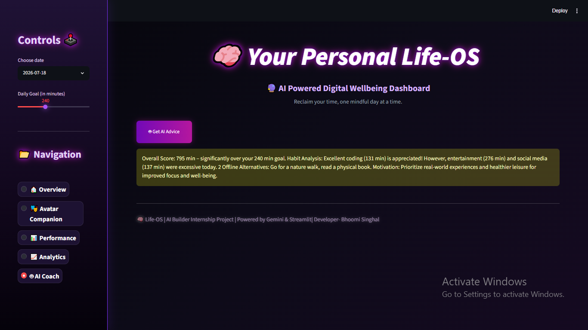
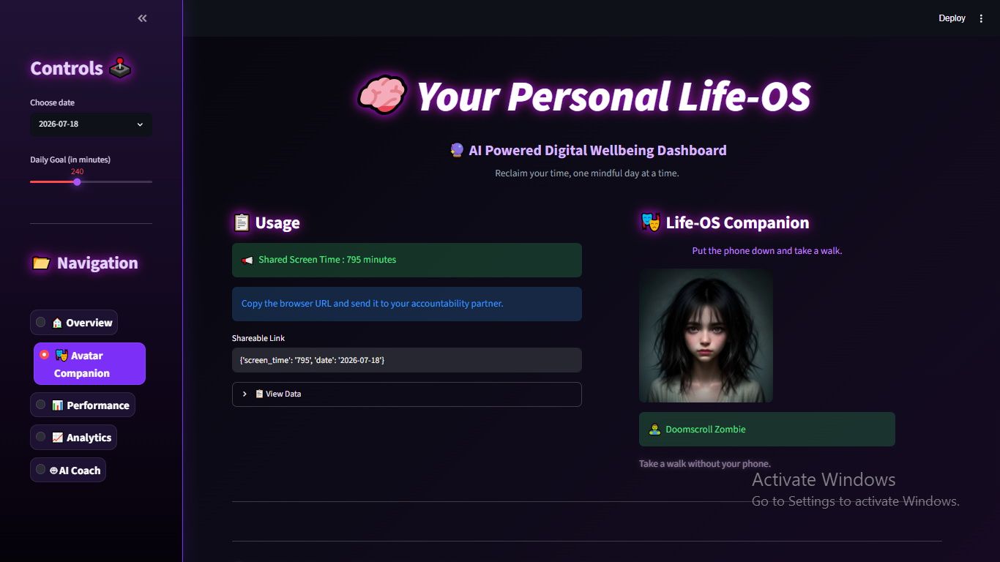
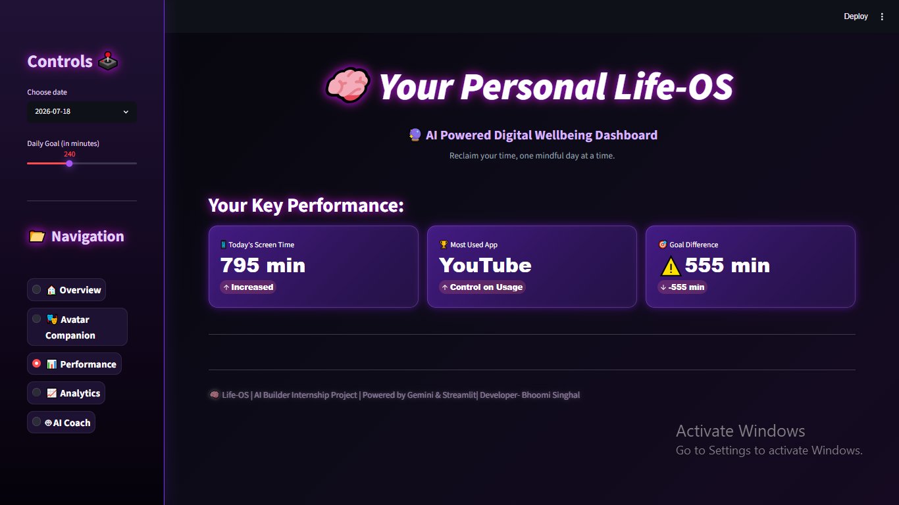
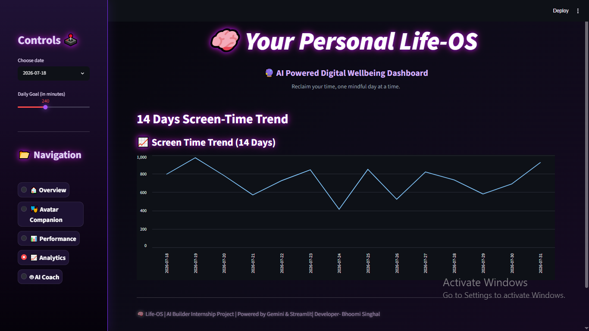

<div align="center">

# 🧠 Life-OS
### *AI Powered Digital Wellbeing Dashboard*



### 🚀 Reclaim your time, one mindful day at a time.

[]()
[]()
[]()
[]()

</div>

---

# 📖 About the Project

Life-OS is an **AI-powered Digital Wellbeing Dashboard** built using **Streamlit** and **Google Gemini AI**.

It analyzes a user's daily screen time habits, visualizes usage trends, generates personalized productivity coaching, and even creates an AI-generated digital avatar representing the user's digital lifestyle.

This project was developed as part of the **MirAI School of Technology – AI Builder Virtual Summer Internship 2026**.

---

# ✨ Features

## 📊 Smart Dashboard

- Daily screen time tracking
- Interactive date selection
- Daily goal slider
- KPI cards
- 14-Day usage trend visualization

---

## 🤖 AI Productivity Coach

Powered by **Google Gemini**

The AI:

- Analyzes screen-time categories
- Detects unhealthy habits
- Appreciates productive coding time
- Suggests offline replacements
- Gives motivational coaching

---

## 🎭 AI Digital Avatar

Gemini generates an image prompt based on your daily habits.

The avatar changes depending on your lifestyle.

Examples:

🧟 Doomscroll Zombie

😴 Distracted Student

🛡️ Focus Warrior

Images are generated dynamically using **Pollinations AI**.

---

## 🔗 Shareable Accountability Link

Uses Streamlit Query Parameters.

Share your daily screen-time results through the URL with friends or accountability partners.

Example:

```
...?date=2026-08-02&screen_time=340
```

---

## 🎨 Modern UI

- Neon glassmorphism theme
- Animated KPI cards
- Responsive layout
- Sidebar navigation
- Dark futuristic interface

---

# 🛠 Tech Stack

| Technology | Purpose |
|------------|---------|
| Python | Backend |
| Streamlit | Dashboard |
| Pandas | Data Processing |
| Google Gemini API | AI Coaching |
| Pollinations AI | AI Avatar |
| HTML + CSS | Custom UI |

---

# 📸 Screenshots

## Dashboard


---

## AI Coach



---

## Digital Avatar



---

## KPI Dashboard



---

## Analytics



---

# 📂 Project Structure

```text
Life-OS/
│
├── app.py
├── screentime.csv
├── requirements.txt
├── .gitignore
├── README.md
├── screenshots/
│   ├── dashboard.png
│   ├── coach.png
│   ├── avatar.png
│   ├── kpi.png
|   └── graph.png
└── .env
```

---

# ⚙ Installation

Clone the repository

```bash
git clone https://github.com/bhoomisinghal0/LifeOs--StreamlitProject
```

Go inside the folder

```bash
cd Life-OS
```

Install dependencies

```bash
pip install -r requirements.txt
```

Create a `.env` file

```env
API_KEY=YOUR_GEMINI_API_KEY
```

Run the app

```bash
streamlit run app.py
```

---

# 🌐 Live Demo

🔗 **Live Application**

> https://lifeos--appproject.streamlit.app/?screen_time=795&date=2026-07-18

---

# 💻 GitHub Repository

🔗 https://github.com/bhoomisinghal0/LifeOs--StreamlitProject

---

# 🎯 Future Improvements

- 🎤 Voice Journal
- 📱 Real Screen-Time API Integration
- 📅 Weekly Habit Reports
- 📈 Productivity Score
- 🏆 Achievement Badges

---

# 👨‍💻 Developer

**Bhoomi Singhal**

B.Tech CSE Student

MirAI School of Technology – AI Builder Internship 2026

LinkedIn: *https://www.linkedin.com/in/bhoomi-singhal-a558a736b/*

GitHub: *https://github.com/bhoomisinghal0*

---

<div align="center">

### ⭐ If you like this project, consider giving it a star!

Made with ❤️ using Streamlit & Gemini AI

</div>